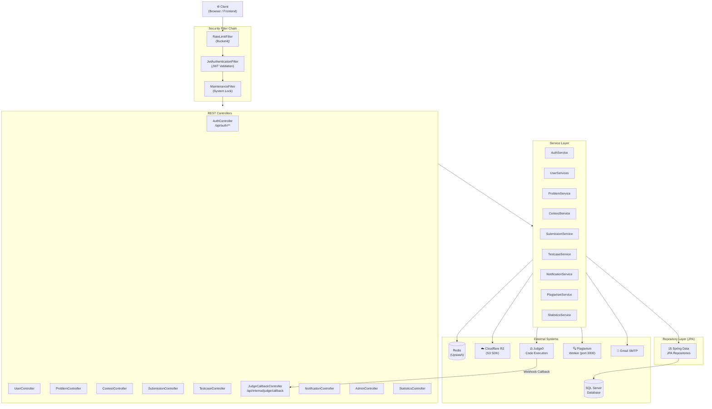
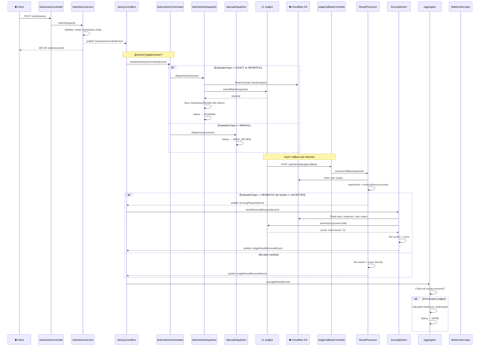
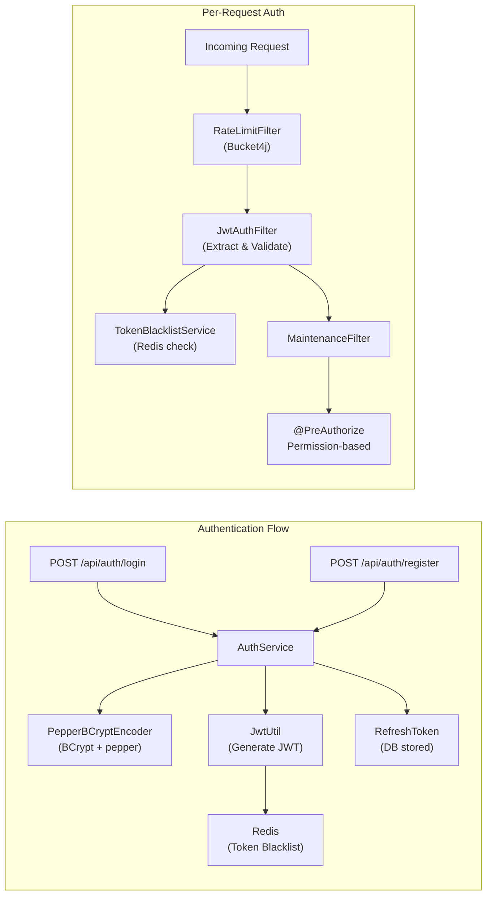
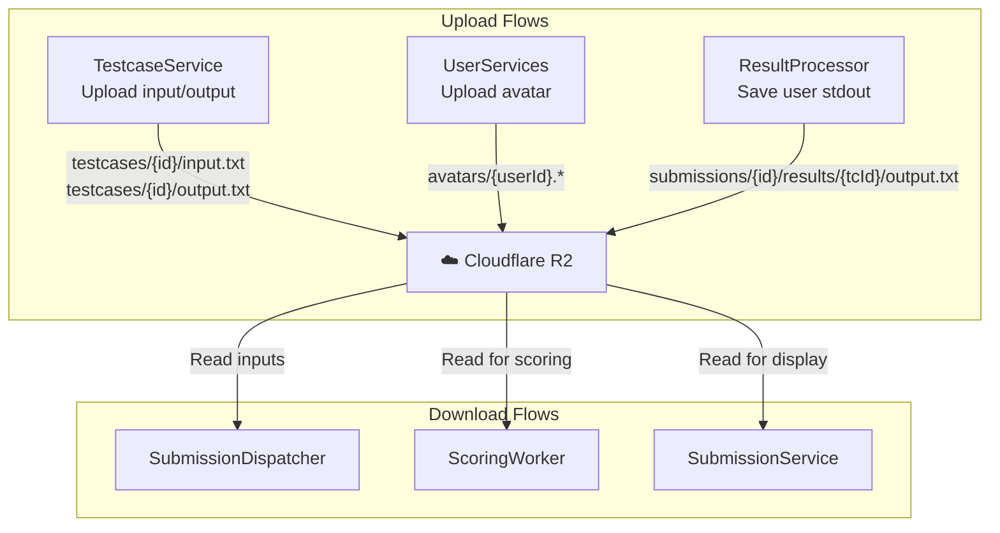
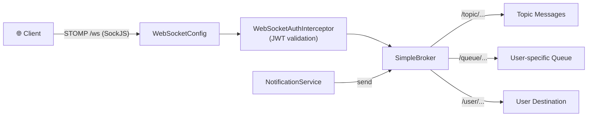
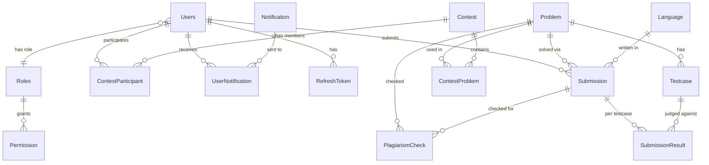

# CodeTrials Backend — Architecture Map

> [!NOTE]
> Chỉ map kiến trúc, **không review code**. Tất cả thông tin được thu thập trực tiếp từ source code.

## Tổng Quan

**CodeTrials** là nền tảng chấm bài lập trình trực tuyến (Online Judge) xây dựng trên **Spring Boot 3.5.9** + **Java 21**. Hệ thống hỗ trợ quản lý cuộc thi, bài tập, nộp bài tự động/thủ công, chống đạo văn (plagiarism detection), và thông báo thời gian thực.

| Thành phần | Công nghệ |
|---|---|
| Framework | Spring Boot 3.5.9 |
| Java | 21 |
| Database | SQL Server (default), PostgreSQL (optional) |
| Cache / Token Blacklist | Redis (Upstash) |
| Object Storage | Cloudflare R2 (qua AWS S3 SDK) |
| Code Judge | Judge0 (self-hosted, port 2358) |
| Plagiarism Detection | Microservice riêng (port 3000) |
| Auth | JWT (jjwt 0.11.5) + OAuth2 |
| Mapper | MapStruct 1.6.3 |
| WebSocket | STOMP over SockJS |
| Build | Maven, Docker multi-stage |

---

## Cấu Trúc Thư Mục

```
backend/
├── Dockerfile                          # Multi-stage build (JDK 21 → JRE 21 Alpine)
├── pom.xml                             # Maven dependencies
├── src/
│   ├── main/
│   │   ├── java/com/example/app/
│   │   │   ├── Application.java        # @SpringBootApplication entry point
│   │   │   │                            # Enables: JPA, Redis, Async, Scheduling
│   │   │   ├── config/                  # ── Infrastructure Configuration ──
│   │   │   │   ├── ApiConfig.java
│   │   │   │   ├── AsyncConfig.java                  # Thread pools: judgeExecutor, scorerExecutor
│   │   │   │   ├── JwtAuthenticationEntryPoint.java   # 401 handler
│   │   │   │   ├── PepperBCryptEncoder.java           # BCrypt + pepper
│   │   │   │   ├── RedisConfig.java
│   │   │   │   ├── S3Config.java                      # Cloudflare R2 client
│   │   │   │   ├── SecurityConfig.java                # Filter chain, CORS, RBAC
│   │   │   │   ├── TokenCleanupScheduler.java         # Scheduled token cleanup
│   │   │   │   ├── WebSocketAuthInterceptor.java      # JWT auth cho WebSocket
│   │   │   │   └── WebSocketConfig.java               # STOMP broker config
│   │   │   │
│   │   │   ├── controller/              # ── REST API Layer (14 controllers) ──
│   │   │   │   ├── AdminController.java
│   │   │   │   ├── AuthController.java
│   │   │   │   ├── ContestController.java
│   │   │   │   ├── HealthCheckController.java
│   │   │   │   ├── JudgeCallbackController.java       # Judge0 webhook receiver
│   │   │   │   ├── LanguageController.java
│   │   │   │   ├── MaintenanceController.java
│   │   │   │   ├── NotificationController.java
│   │   │   │   ├── ProblemController.java
│   │   │   │   ├── StatisticsController.java
│   │   │   │   ├── SubmissionController.java
│   │   │   │   ├── SystemSettingsController.java
│   │   │   │   ├── TestcaseController.java
│   │   │   │   └── UserController.java
│   │   │   │
│   │   │   ├── service/                 # ── Business Logic Layer (21+ services) ──
│   │   │   │   ├── AdminService.java
│   │   │   │   ├── AuthService.java
│   │   │   │   ├── ContestService.java               # ~15KB, largest service
│   │   │   │   ├── CustomUserDetails[Service].java    # Spring Security UserDetails
│   │   │   │   ├── EmailService.java                  # Gmail SMTP
│   │   │   │   ├── Judge0Client.java                  # HTTP client → Judge0 API
│   │   │   │   ├── JudgeRateLimiter.java              # Semaphore-based rate limiting
│   │   │   │   ├── JudgeTimeoutService.java           # Recovery cho stuck submissions
│   │   │   │   ├── LanguageService.java
│   │   │   │   ├── NotificationService.java
│   │   │   │   ├── OutputGeneratorService.java
│   │   │   │   ├── PlagiarismService.java             # ~13KB, plagiarism detection
│   │   │   │   ├── ProblemService.java
│   │   │   │   ├── S3StorageService.java              # Cloudflare R2 abstraction
│   │   │   │   ├── StatisticsService.java
│   │   │   │   ├── SubmissionService.java             # ~15KB, submission CRUD
│   │   │   │   ├── SystemSettingsService.java
│   │   │   │   ├── TestcaseService.java
│   │   │   │   ├── TokenBlacklistService.java         # Redis-based JWT blacklist
│   │   │   │   ├── UserServices.java
│   │   │   │   └── submission/          # ── Judging Pipeline (event-driven) ──
│   │   │   │       ├── SubmissionOrchestrator.java     # Entry point: event listener
│   │   │   │       ├── SubmissionDispatcher.java       # EXACT/HEURISTIC → Judge0
│   │   │   │       ├── ManualDispatcher.java           # MANUAL → NEED_REVIEW
│   │   │   │       ├── ResultProcessor.java            # Judge0 callback handler
│   │   │   │       ├── ScoringWorker.java              # HEURISTIC scorer runner
│   │   │   │       ├── Aggregator.java                 # Final score aggregation
│   │   │   │       └── event/
│   │   │   │           ├── SubmissionCreatedEvent.java
│   │   │   │           ├── JudgeResultReceivedEvent.java
│   │   │   │           ├── ScoringRequiredEvent.java
│   │   │   │           └── ManualScoredEvent.java
│   │   │   │
│   │   │   ├── entity/                  # ── JPA Entities (19 entities) ──
│   │   │   │   ├── Contest.java
│   │   │   │   ├── ContestParticipant.java + ContestParticipantId.java
│   │   │   │   ├── ContestProblem.java + ContestProblemId.java
│   │   │   │   ├── Language.java
│   │   │   │   ├── Notification.java
│   │   │   │   ├── Permission.java
│   │   │   │   ├── PlagiarismCheck.java
│   │   │   │   ├── Problem.java
│   │   │   │   ├── RefreshToken.java
│   │   │   │   ├── Roles.java
│   │   │   │   ├── Submission.java
│   │   │   │   ├── SubmissionResult.java
│   │   │   │   ├── SystemSettings.java
│   │   │   │   ├── Testcase.java
│   │   │   │   ├── UserNotification.java + UserNotificationId.java
│   │   │   │   ├── Users.java
│   │   │   │   └── enums/
│   │   │   │       ├── ContestState.java
│   │   │   │       ├── Difficulty.java
│   │   │   │       ├── EvaluationType.java            # EXACT | HEURISTIC | MANUAL
│   │   │   │       ├── PlagiarismVerdict.java
│   │   │   │       ├── SubmissionStatus.java          # COMPILING | RUNNING | DONE | ERROR | NEED_REVIEW
│   │   │   │       └── Verdict.java                   # ACCEPTED | FAILED | PARTIAL | TLE | MLE | CE | RE
│   │   │   │
│   │   │   ├── repository/             # ── Data Access Layer (15 repos) ──
│   │   │   │   ├── Contest[*]Repository.java          # (3 repos)
│   │   │   │   ├── LanguageRepository.java
│   │   │   │   ├── NotificationRepository.java
│   │   │   │   ├── PlagiarismCheckRepository.java
│   │   │   │   ├── ProblemRepository.java
│   │   │   │   ├── RefreshTokenRepository.java
│   │   │   │   ├── RoleRepository.java
│   │   │   │   ├── Submission[Result]Repository.java  # (2 repos, ~5KB cho Submission)
│   │   │   │   ├── SystemSettingsRepository.java
│   │   │   │   ├── TestcaseRepository.java
│   │   │   │   ├── UserNotificationRepository.java
│   │   │   │   └── UserRepository.java
│   │   │   │
│   │   │   ├── dto/                     # ── Data Transfer Objects ──
│   │   │   │   ├── ApiResponse.java                   # Generic wrapper {message, result}
│   │   │   │   ├── request/
│   │   │   │   │   ├── auth/            # LoginRequest, RegisterRequest
│   │   │   │   │   ├── contest/         # Create, Update, AddProblem, BulkAddParticipants
│   │   │   │   │   ├── notification/    # CreateNotification, SendEmail
│   │   │   │   │   ├── problem/         # Create, Update
│   │   │   │   │   ├── submission/      # SubmitCode, ManualGrade
│   │   │   │   │   ├── testcase/        # Create, Update
│   │   │   │   │   └── user/            # Create, AdminUpdate, ChangePassword, ProfileUpdate
│   │   │   │   ├── response/            # 20 response DTOs
│   │   │   │   └── judge0/              # Judge0Request, Judge0Response, Judge0CallbackPayload
│   │   │   │
│   │   │   ├── mapper/                  # ── MapStruct Mappers (5) ──
│   │   │   │   ├── ContestMapper.java
│   │   │   │   ├── ProblemMapper.java
│   │   │   │   ├── SubmissionMapper.java
│   │   │   │   ├── TestcaseMapper.java
│   │   │   │   └── UserMapper.java
│   │   │   │
│   │   │   ├── security/               # ── Security Filters & Utils ──
│   │   │   │   ├── JwtAuthenticationFilter.java       # JWT extraction & validation
│   │   │   │   ├── JwtUtil.java                       # Token generation & parsing
│   │   │   │   ├── MaintenanceFilter.java             # System maintenance mode
│   │   │   │   ├── RateLimitFilter.java               # Bucket4j rate limiting
│   │   │   │   └── SecurityHelper.java                # Current user context
│   │   │   │
│   │   │   ├── exception/              # ── Error Handling ──
│   │   │   │   ├── AppException.java
│   │   │   │   ├── ErrorCode.java                     # Centralized error codes (~3.5KB)
│   │   │   │   └── GlobalExceptionHandler.java        # @ControllerAdvice
│   │   │   │
│   │   │   ├── helpers/
│   │   │   │   └── PasswordGenerator.java
│   │   │   │
│   │   │   └── util/                   # ── Plagiarism Utilities ──
│   │   │       ├── AstSimilarityUtil.java
│   │   │       ├── CfgSimilarityUtil.java
│   │   │       ├── CodeNormalizer.java
│   │   │       └── WinnowingUtil.java
│   │   │
│   │   └── resources/
│   │       ├── application.properties
│   │       └── application.properties.example
│   │
│   └── test/java/                       # Test directory (structure exists)
```

---

## Sơ Đồ Luồng Dữ Liệu (Data Flow)

### 1. Luồng Tổng Thể — Request Lifecycle



---

### 2. Luồng Chấm Bài — Submission Judging Pipeline (Event-Driven)

Đây là luồng phức tạp nhất của hệ thống, sử dụng **Spring Application Events** để tạo pipeline async.



---

### 3. Luồng Authentication & Authorization



---

### 4. Luồng Dữ Liệu File Storage (Cloudflare R2)



---

### 5. Luồng Real-Time (WebSocket)



---

### 6. Entity Relationship Map



---

## Bảng Tóm Tắt Các Tích Hợp Bên Ngoài

| Hệ thống | Vai trò | Giao tiếp | File liên quan |
|---|---|---|---|
| **Judge0** (localhost:2358) | Thực thi & chấm code | HTTP REST + Webhook callback | [Judge0Client](file:///d:/Code/CodeTest/backend/src/main/java/com/example/app/service/Judge0Client.java), [JudgeCallbackController](file:///d:/Code/CodeTest/backend/src/main/java/com/example/app/controller/JudgeCallbackController.java) |
| **Cloudflare R2** | Lưu trữ testcase I/O, avatar, output | AWS S3 SDK | [S3StorageService](file:///d:/Code/CodeTest/backend/src/main/java/com/example/app/service/S3StorageService.java), [S3Config](file:///d:/Code/CodeTest/backend/src/main/java/com/example/app/config/S3Config.java) |
| **Redis** (Upstash) | Token blacklist, caching | Spring Data Redis + SSL | [RedisConfig](file:///d:/Code/CodeTest/backend/src/main/java/com/example/app/config/RedisConfig.java), [TokenBlacklistService](file:///d:/Code/CodeTest/backend/src/main/java/com/example/app/service/TokenBlacklistService.java) |
| **SQL Server** | Primary database | JPA/Hibernate | 15 Repository files |
| **Plagiarism Worker** (localhost:3000) | Phân tích đạo văn code | HTTP REST | [PlagiarismService](file:///d:/Code/CodeTest/backend/src/main/java/com/example/app/service/PlagiarismService.java) |
| **Gmail SMTP** | Gửi email thông báo | JavaMail | [EmailService](file:///d:/Code/CodeTest/backend/src/main/java/com/example/app/service/EmailService.java) |

---

## Đặc Điểm Kiến Trúc Nổi Bật

1. **Event-Driven Judging Pipeline**: Submission → Orchestrator → Dispatcher → Judge0 → Callback → ResultProcessor → Scorer (nếu HEURISTIC) → Aggregator. Toàn bộ sử dụng Spring `ApplicationEvent` + `@Async`.

2. **3 Evaluation Types**: `EXACT` (so sánh output), `HEURISTIC` (custom scorer chạy trên Judge0), `MANUAL` (giáo viên chấm tay).

3. **Permission-based RBAC**: Không dùng role-based đơn giản mà dùng permission granular (e.g., `PROBLEM_READ`, `TESTCASE_CREATE`, `SUBMISSION_REJUDGE`).

4. **Retry & Recovery**: `JudgeTimeoutService` tự động phục hồi submission bị stuck. Judge0 client có retry config (max 3 attempts, exponential backoff).

5. **Rate Limiting ở 2 tầng**: HTTP level (Bucket4j filter) + Judge0 level (Semaphore-based `JudgeRateLimiter`).

6. **Security hardening**: BCrypt + pepper, JWT blacklist qua Redis, maintenance mode filter, HSTS, XSS protection headers, CORS whitelist.
